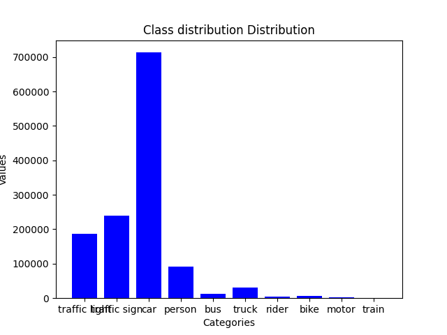

## Repository to train and infer a multiclass object detector on BDD data set

The repository contains source codes to do the following
1. To run the dash board for data analysis
2. To run a training for YoloX as object detector 
3. Evaluation and visualization of YoloX model 

## Data analysis Dashboard

It is better if you execute through the docker image. The docker image is available [here]

Step 1: Download the docker the docker image and load 
```shell
docker image load -i soum_bdd.tar


```
Step 2: Create a docker container from the image using  

```shell
docker run -itd -v ${PWD}:/app --name your_preferred_name -p 7680:7680 image_name:tag bash
```
your present working directory should also contain the folders bdd100k_images_100k, bdd100k_labels_release

Step 3: Launch the gradio UI
```shell
python tabbed_gradio.py
```
Step 4: Navigate as per the fields and please keep in mind the following
    1. The absolute path of the json files should not be given. Expected arguments are like bdd100k_labels_release\bdd100k\labels\bdd100k_labels_images_train.json
    2. While choosing the sample level tabs please ensure the class names are in lower caps as mentiond in the jsons
If not followed the dashbord might through unhandled exception which were considered out of scope

Alternatively you can create a virtual environment and do the following steps:

Step 1: 
```shell
python -m venv {your preferred name}
source activate {your preferred name}/Scrips/activate or source activate {your preferred name}/bin/activate
pip install -r requirements.txt
```
if you face error in pep517 consider setting --no-use-pep517 in pip install or upgrade pip version

```shell
python tabbed_gradio.py
```

The considereations mentioned before on inputs apply here as well. 
A sample output for training class distribution and unique sample 

 
 Observations:

 1. The data distributions were highly skwewed with over represented and under represented image samples
 2. The distribution of class wise bounding box area shows abundance of out of distribution samples

  

 The above plots suggest the observations

 3. The unique samples chosen were the out of distribution samples in terms of area, as of now only max and min area per class has been shown but can be easily expanded to other attributes as well

 The repo also contains some prerequite check for making the data trainimg ready

 Check and delete the train-val overlap if any 
 ```shell 
 python check_train_val.py
 ```
## Training YoloX for object detection

The reasons for choosing YoloX are as follows

1. Unlike earlier YOLO versions and many other detectors (like RetinaNet or Faster R-CNN), YOLOX adopts an anchor-free approach, simplifying the training process and reducing hyperparameter tuning.
2. YOLOX uses a decoupled head for classification and regression tasks, which improves performance by allowing each task to specialize and optimize independently.
3. It leverages Mosaic and MixUp augmentations, which help the model generalize better and improve performance on small and occluded objects.
4. YOLOX supports end-to-end training, including NMS which simplifies deployment and improves inference speed.

Steps for YoloX training

The docker image has not got Yolox installed as it would un-necessarily make the image size large.  

1. The steps of installation are mentioned in https://github.com/Megvii-BaseDetection/YOLOX
```shell 
cd YOLOX
pip3 install -v -e .
```

2. To run the training the data should be converted to coco format, both train and val
```shell
python convert_coco.py
```
Mention the path of the input trainimng jsons and the target json

3. Resize the images to 640 (YoloX requirements)
4. To run the training create an experiment file, the one used for this case has been provided ```shell bdd.py```
5. Run the training command 
```shell
python -m yolox.tools.train -f bdd.py -d {No of GPU} -b {batch size} --fp16 -o 
```
Few epochs could be trained and the trainied weight has been shared, however the model performnce is very poor as the training did not converge as a fraction of the data was being used

## Evaluating the object detection

# Model

A pretrained yolox-s on coco data set has been chosen. The overlapping class between BDD and Coco has been evaluated. The class names are
person, truck, car, traffic light and bus

Score for Evaluation chosen is MAP@0.5. 

To compute the MAP score follows:

step 1: Generate the GT per image
```shell
python prep_GT.py
```

step 2: Generate the predictions
Please use the weight yolox_s.pth, and yolox_s.py [here]https://drive.google.com/drive/folders/1u_xxsu1K-kI66Nsy7Om7tiQp7qwlfWhj?usp=sharing for reproducing the results. You can use best_ckpt.pth with bdd.py as experiment file but it would produce severly incorrect boxes

```shell
python tools/demo.py image -f {your experiment.py file} -c /path/to/your/yolox_s.pth --path {Your folder} --conf 0.25 --nms 0.45 --tsize 640
```

This step generates the prediction with the bounding boxes marked. The confidence values and the class labels are also impainted.

step 3: calculate the MAP
```shell
python MAP.py
```

The class wise MAP values are as follows:

Traffic Light: 0.06170678, Car: 0.39349082, Person: 0.11904762, Bus: 0.05248447, Truck: 0.09066598

